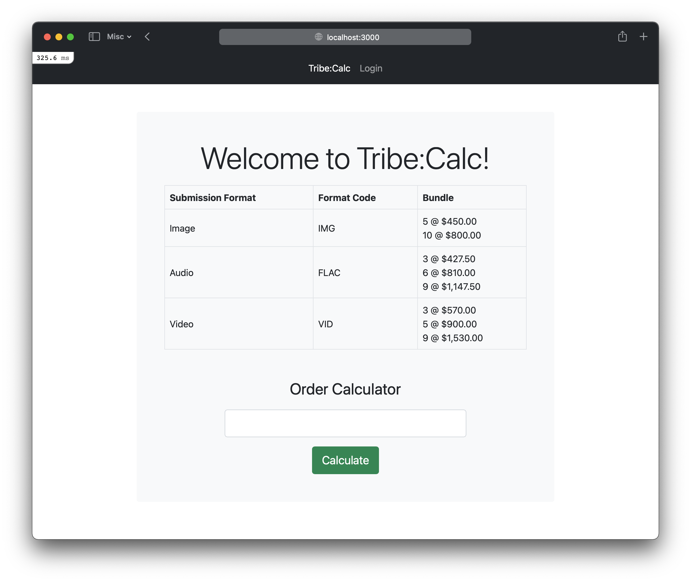
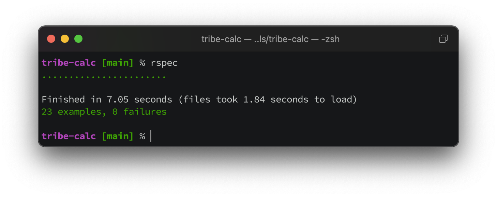

# Tribe:Calc

Tribe Calculator is a coding challenge that computes the bundle combination for the orders containing different media (img, flac, vid).

## Live Demo:

- The app is deployed in my private server - [Tribe:Calc Demo](https://tribe-calc.ikennonline.com)

## Installation:

### Requirements

- Ruby 2.6.3
- [NodeJS](https://nodejs.org/en/ "(target|_blank)")
- [Git](https://git-scm.com/downloads "(target|_blank)")
- [Bundler](https://bundler.io "(target|_blank)")

### Components

- Rails 6.1.4
- SQLite 3
- RSpec 5

### Procedure

- Clone the project from the public respository (using git):
  `git clone git@github.com:kennethjohnbalgos/tribe-calc.git`

- Go to the cloned directory:
  `cd tribe-calc`

- Install the bundle:
  `bundle install`

- Install the webpacker:
  `rails webpacker:install`

- Run the database migration:
  `rails db:migrate`

- Seed the database:
  `rails db:seed`

- Start the rails server:
  `rails server`

- Voila! It should now be accessible in local browser:
  `http://localhost:3000`
  

## Future Improvements

- Users can register or log in (implemented)
- Logged in users can save order data (not yet implemented)
- Logged in admin can update the pricing table (not yet implmeneted)
  ```text
  Default Admin Email: admin@email.com
  Default Admin Password: kcknmb
  ```

## Test Coverage

- The tests covers the following:
  -- Sessions: Login, Registration, and Logout
  -- Models: Format and Bundles validation
  -- Features: Calculator Accessiblity and Functionality

- To run the test, trigger it inside the project folder:
  `rspec`

- Sample test result:
  

## Contributing

- This is disabled for this project as this app is for Coding Challenge of Tribe Group only.

## License

Tribe:Calc is released under the [MIT License](https://opensource.org/licenses/MIT "(target|_blank)").
